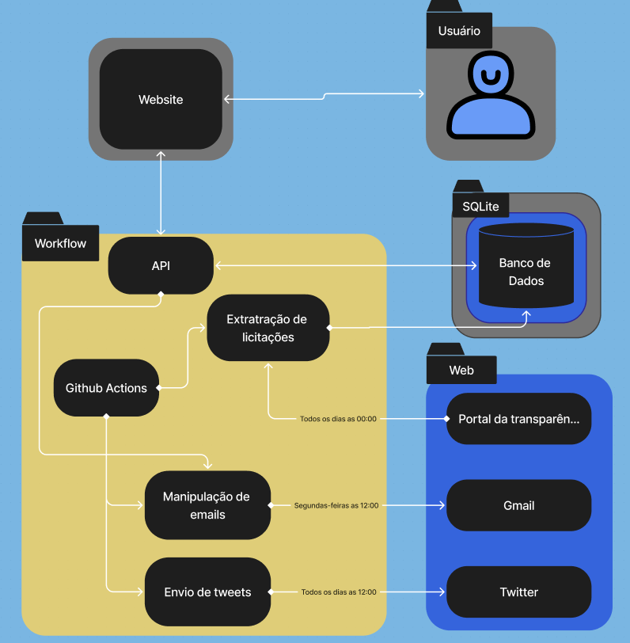

# Documentação de Arquitetura - LicitaBSB

## Introdução

O projeto LicitaBSB visa coletar licitações do site "Diário Oficial da União" relacionadas a Brasília e organizá-las em um feed de rede social. Os usuários poderão realizar buscas avançadas para encontrar licitações específicas de seu interesse. 

### Diagrama de Arquitetura

#### Fluxo de Trabalho
- **Coleta de dados:** Quando ativado, o GitHub Actions ativa um script para a raspagem de dados no portal da transparência.
- **Processamento e Análise:** Os dados obtidos são processados, analisados e padronizados.
- **Armazenamento** Os dados processados são armazenados no banco de dados.
- **Visualização:** Os resultados são apresentados no nosso site e enviado para o nosso bot do twitter.

## Tecnologias Escolhidas

- **Front-end:** HTML, CSS e JavaScript.
- **Back-end:** [Python](https://www.python.org/) e JavaScript.
- **Banco de Dados:** [SQLite](https://www.sqlite.org/).
- **Framework Web:** [React](https://react.dev/)
- **Ferramenta de Coleta de Dados:** Framework [BeautifulSoup4](https://beautiful-soup-4.readthedocs.io/en/latest/).

| Tecnologia | versão          |
|------------|-----------------|
| python     | 3.12.4          |
| Html       | html5           |
| Css        | CSS3            |
| JavaScript | ECMAScript 2023 |
| React      | 18.2.0          |
| SQLite     | 3.46.0          |

## Back-end

### Coleta de dados

- Primariamente feita pela biblioteca `BeautifulSoup` e acionado pelo GitHub Actions todos os dias as 01 hora da manhã, todo o script e sua funcionalidade esta presente na pasta `coleção_de_dados`, onde é feita a extração dos dados do diário oficial e análise dos dados.

- A pasta `extrair_dados_csv` se trata de um script que extrai informações sobre licitações de um CSV, o script serviu para construir o banco de dados com licitações antes de 05/02/2018, pois o site do diário oficial não possui informações previas a esta data.

- Após a extração e análise de dados ele são armazenados no nosso banco em SQLite, observável na pasta `server`.

### Twitter

- Todas as ações referentes ao twitter se encontra no script `auto.py` que é acionado todos os dias as 12 horas, no qual extrai do banco de dados as últimas licitações adicionadas e as postas no twitter.

### E-mails

- O script `server.js` se trata de um script acionado pelo front-end quando algum usuário envia o email dele através de um campo no nosso site, esse script envia o e-mail informado para a base de dados do Mailchimp.

- Já o script `sendEmail.js` é acionado regulamente toda semana as segunda-feiras as 12 horas, enviando um email de aviso que nosso site foi atualizado com novas licitações.

## Front-end

O front-end foi desenvolvido utilizando a biblioteca React com o framework Vite e está localizado na pasta ‘frontend’ do repositório do projeto. Os principais códigos estão na pasta src, onde o arquivo main.jsx configura as rotas da página e as configurações iniciais do React. As pastas estão organizadas da seguinte forma: utils contém funções reutilizáveis, styles armazena as estilizações globais, services inclui arquivos que se comunicam com a base de dados no backend, pages possui subpastas para cada página do site e components guarda trechos de código reutilizáveis para várias páginas.

O frontend está dividido nas seguintes pastas: **src**, **utils**, **styles**, **services**, **pages** e **components**.

- **src:**
  - `main.jsx`: Contém o código inicial e as configurações das rotas da página, além das configurações iniciais do React.

- **utils:**
  - Contém funções com pequenas funcionalidades utilizadas por todos os componentes do projeto.

- **styles:**
  - Contém as estilizações globais da página.

- **services:**
  - Contém os arquivos que se comunicam diretamente com a nossa base de dados presente na pasta `backend`.

- **pages:**
  - Contém subpastas dedicadas a cada página específica do site.

- **components:**
  - Contém trechos de código reutilizados por mais de uma página do site, organizando melhor as funcionalidades do site e tornando o código mais limpo e centralizado.

### Fluxo de Raspagem

1. **Acionamento da raspagem:**
- Todos os dias as 01:01 o GitHub Actions ativa a raspagem de dados.

2. **Obter parâmetros da Raspagem:**
- Os parâmetros enviados pelo GitHub actions é apenas `avisos`, no qual habilita o script a apenas pegar as licitações do dia anterior a data atual.
- Obs: os parâmetros para a raspagem podem ser bastante customizados para mais detalhes leia o arquivo `README.md` dentro da pasta de `colecao_de_dados`.

3. **Iterar por quantidade de dias:**

    Para cada dia no intervalo:
  
  - **Capturar Link do DOU:**
    - Utilizar a função `link_jornal_diario` para obter o link da página do DOU para o dia específico.

  - **Extrair URLs de Títulos:**
    - Utilizar a função `extrair_url_titles` para extrair as URLs dos títulos dos avisos de licitação a partir da página do DOU.

  - **Extrair Avisos de Licitação:**
    - Utilizar a função `extraindo_avisos_licitacao` para filtrar as URLs dos títulos e identificar apenas os avisos de licitação.

  - **Criar lista com Avisos:**
    - Processar cada aviso de licitação:
      - Extrair informações como tipo, número, órgão, objeto, data de abertura, valores e outras.
      - Salvar as informações em uma lista.
      - Utilizar a função `alimentando_banco_com_licitacoes` para realizar o processo completo.

  - **Filtrar por Brasília:**
    - Utilizar a função `filtrando_os_avisos_de_brasilia` para garantir que apenas os avisos relacionados a Brasília sejam incluídos no arquivo banco de dados.

4. **Armazenamento:**

    - Após a extração de dados e analise, os dados são armazenados no banco de dados SQLite.

## Histórico de Versões

| Data       | Versão | Descrição                                   | Autores         |
|------------|--------|---------------------------------------------|-----------------|
| 2024-04-12 | 1.0    | Versão inicial da documentação              | Marcelo Adrian  |
| 2024-07-01 | 1.1    | Modificações segundo requisições            | Marcelo Adrian  |
| 2024-07-08 | 1.2    | Explicações estruturais                     | Marcelo Adrian  |
| 2024-07-11 | 1.3    | Explicação da raspagem de dados             | Marcelo Adrian  |
| 2024-07-14 | 2.0    | Informações sobre o Frontend                | Marcelo Adrian  |
| 2024-07-14 | 2.1    | Reestruturação de acordo com novas features | Marcelo Adrian  |
