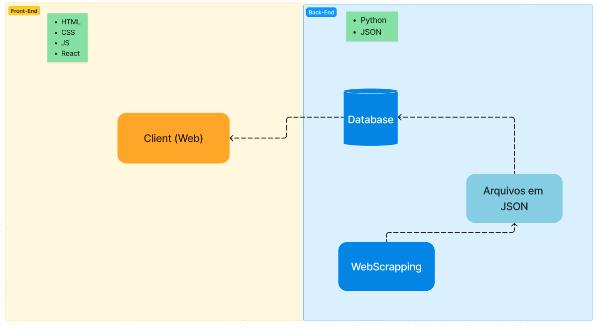

# Documentação de Arquitetura - LicitaBSB

## Introdução

O projeto LicitaBSB tem como objetivo coletar licitações do site "Meu Querido Diário" relacionadas a Brasília e organizá-las em um feed de rede social. Os usuários poderão realizar buscas avançadas para encontrar licitações específicas de seu interesse.

### Diagrama de Arquitetura

## Camadas

### Camada de Apresentação

1. **Model**: Esta parte será responsável pela lógica do projeto e pelo gerenciamento dos dados da aplicação. Ela atua como um intermediário para manipular dados entre o banco de dados e a Visualização. Em sua interação com o banco de dados, permite a criação, leitura, atualização e exclusão de informações, garantindo a integridade e consistência dos dados.

2. **View**: Será responsável por lidar com a lógica de apresentação e a resposta aos usuários. Seu papel é formatar os dados recebidos do banco de dados por meio do Modelo para exibição e selecionar os templates apropriados para renderizar a resposta. Ela funcionará como a intermediária da arquitetura, controlando o fluxo entre a lógica do projeto e a interface do usuário.

3. **Template**: Responsável pela apresentação final dos dados ao usuário. Ela armazena os arquivos HTML, CSS e Bootstrap estendidos, e define a estrutura e o layout da interface do usuário. Assim, os templates serão usados para renderizar o conteúdo visual de maneira consistente e estilizada.

## **Tecnologias**: 

- A nossa aplicação utiliza HTML, CSS e JavaScript para o front-end, Python no back-end e o banco de dados é utilizado apenas arquivos salvos em JSON.

    | **Tecnologia**    | **Versão**  |
    |---------------|---------|
    | React         |  18.0.0 |
    | JavaScript    |  2019   |
    | Python        |  3.12.4 |

## Histórico de Versões

| Data       | Versão | Descrição                               | Autores      |
|------------|--------|-----------------------------------------|--------------|
| 2024-04-12 | 1.0    | Versão inicial da documentação           | Marcelo Adrian |
| 2024-07-01 | 1.1    | Modificações segundo requisições           | Marcelo Adrian |
