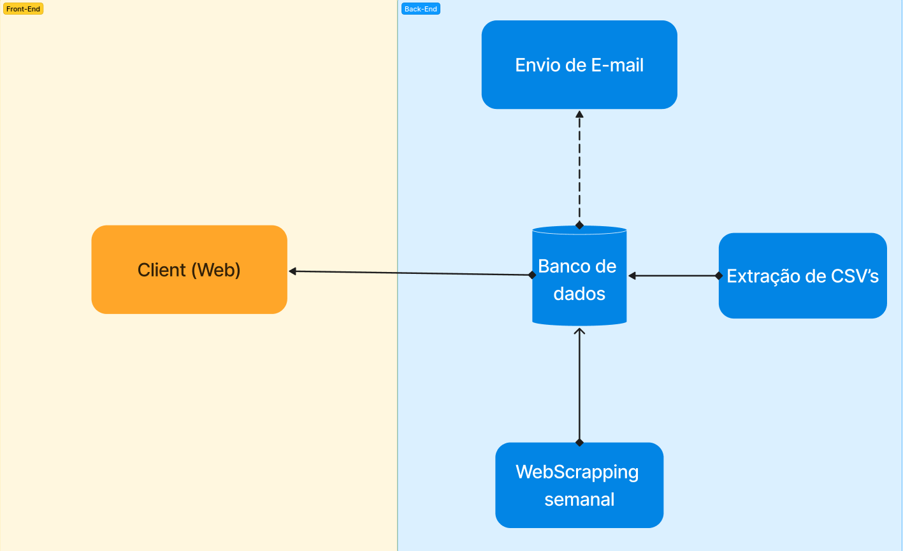

# Documentação de Arquitetura - LicitaBSB

## Introdução

O projeto LicitaBSB tem como objetivo coletar licitações do site "Diário Oficial da União" relacionadas a Brasília e organizá-las em um feed de rede social. Os usuários poderão realizar buscas avançadas para encontrar licitações específicas de seu interesse.

### Diagrama de Arquitetura



#### Fluxo de Trabalho
- **Entrada de dados:** Os dados são obtidos através das extração de dados oficiais do governo.
- **Processamento e Análise:** Os dados são processados e analisados em tempo real, utilizando bibliotecas e scripts para manipulação de dados.
- **Visualização:** Os resultados são apresentados de maneira intuitiva por meio de gráficos, tabelas e outras visualizações interativas.

## Tecnologias Escolhidas

- **Front-end:** HTML, CSS e JavaScript.
- **Back-end:** Python.
- **Banco de Dados:** JSON no próprio GitHub.
- **Framework Web:** [React](https://react.dev/)
- **Ferramenta de Coleta de Dados:** Framework [BeautifulSoup4](https://beautiful-soup-4.readthedocs.io/en/latest/) e [Requests](https://pypi.org/project/requests/).

| Tecnologia | versão          |
|------------|-----------------|
| python     | 3.12.4          |
| Html       | html5           |
| Css        | CSS3            |
| JavaScript | ECMAScript 2023 |
| React      | 18.2.0          |


## Estrutura do Backend

O backend está dividido em três pastas: **extrair_dados_csv**, **data_collection_avisos** e **data_collection_extrato**.

- **extrair_dados_csv:**
  - `licitacoes_csv`: Pasta contendo as licitações do site [Portal da Transparência](https://portaldatransparencia.gov.br/download-de-dados/licitacoes_csv).
  - `extrair_dados_csv.py`: Utiliza as bibliotecas [os](https://docs.python.org/3/library/os.html), [csv](https://docs.python.org/3/library/csv.html) e [json](https://docs.python.org/3/library/json.html) para iterar sobre os arquivos contidos na pasta `licitacoes_csv`, extraindo os dados de licitações de Brasília e armazenando-os no arquivo `dados_csv.json`.
  - `dados_csv.json`: Base de dados das licitações do projeto, gerada pela função `extrair_dados_csv.py`.

- **Data_collection_avisos:** 
  - `database/data.json`: Base de dados completa pela junção da base de dados gerada pelo `extrair_dados_csv` e a `main.py`.
  - `function.py`: Utiliza as bibliotecas [os](https://docs.python.org/3/library/os.html), [requests](https://pypi.org/project/requests/), [re](https://docs.python.org/3/library/re.html), [datetime](https://docs.python.org/3/library/datetime.html), [bs4](https://pypi.org/project/beautifulsoup4/), [json](https://docs.python.org/3/library/json.html) e [urllib3](https://pypi.org/project/urllib3/) para auxiliar nas operações feitas em `main.py`.
  - `main.py`: Utiliza as bibliotecas [sys](https://docs.python.org/3/library/sys.html) e [datetime](https://docs.python.org/3/library/datetime.html) para realizar a extração de avisos de licitações a partir de um intervalo de datas fornecido pelo usuário ou do dia anterior à execução.

- **Data_collection_extrato:** Possui a mesma função da `main.py` da pasta `data_collection_avisos`, porém direcionada à extração apenas de extratos.

A pasta `extrair_dados_csv` foi utilizada para fazer a extração inicial dos dados para nosso banco de dados, enquanto as pastas `data_collection_avisos` e `data_collection_extrato` servem para tirar semanalmente as licitações novas. O método usado em `extrair_dados_csv`, embora completo, só consegue pegar os dados fornecidos pelo Portal da Transparência, que demoram um mês ou mais para estarem prontos.

## Fluxo de Raspagem

1. **Obter parâmetros da Raspagem:**

    A. **Processar desde 05/02/2018 até a data atual:**
    ```sh
    python3 main.py
    ```

    B. **Processar desde uma data inicial até a data atual:**
    ```sh
    python3 main.py <dia-inicial>/<mes-inicial>/<ano-inicial>
    ```

    Exemplo:
    ```sh
    python3 main.py 01/01/2020
    ```

    C. **Processar um intervalo específico de datas:**
    ```sh
    python3 main.py <dia-inicial>/<mes-inicial>/<ano-inicial> <dia-final>/<mes-final>/<ano-final>
    ```

    Exemplo:
    ```sh
    python3 main.py 01/01/2020 31/12/2020
    ```

2. **Iterar por quantidade de dias:**

    Para cada dia no intervalo:

    - **Capturar Link do DOU:**
        - Utilizar a função `link_jornal_diario` para obter o link da página do DOU para o dia específico.

    - **Extrair URLs de Títulos:**
        - Utilizar a função `extrair_url_titles` para extrair as URLs dos títulos dos avisos de licitação a partir da página do DOU.

    - **Extrair Avisos de Licitação:**
        - Utilizar a função `extraindo_avisos_licitacao` para filtrar as URLs dos títulos e identificar apenas os avisos de licitação.

    - **Criar JSON com Avisos:**
        - Processar cada aviso de licitação:
            - Extrair informações como tipo, número, órgão, objeto, data de abertura, valores e outras.
            - Salvar as informações em um arquivo JSON.
        - Utilizar a função `criandojsoncomavisos` para realizar o processo completo.

    - **Filtrar por Brasília:**
        - Utilizar a função `filtrando_os_avisos_de_brasilia` para garantir que apenas os avisos relacionados a Brasília sejam incluídos no arquivo JSON final.

3. **Armazenar em JSON:**

    - Salvar o arquivo JSON com as informações dos avisos de licitação no diretório `database`.


## Histórico de Versões

| Data       | Versão | Descrição                               | Autores         |
|------------|--------|-----------------------------------------|-----------------|
| 2024-04-12 | 1.0    | Versão inicial da documentação          | Marcelo Adrian  |
| 2024-07-01 | 1.1    | Modificações segundo requisições        | Marcelo Adrian  |
| 2024-07-08 | 1.2    | Explicações estruturais                 | Marcelo Adrian  |
| 2024-07-11 | 1.3    | Explicação da raspagem de dados         | Marcelo Adrian  |