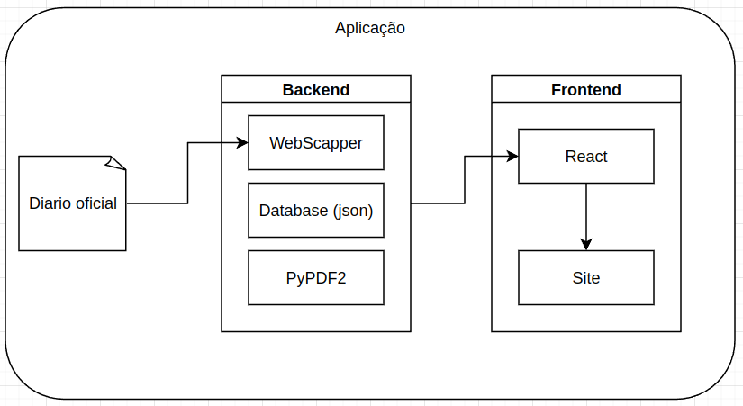

---
hide:
  - navigation
  - toc
---

# Documentação de Arquitetura - LicitaBSB

## Introdução

O projeto LicitaBSB tem como objetivo coletar licitações do site "Meu Querido Diário" relacionadas a Brasília e organizá-las em um feed de rede social. Os usuários poderão realizar buscas avançadas para encontrar licitações específicas de seu interesse.

### Diagrama de Arquitetura

## Camadas

### Camada de Apresentação

A camada de apresentação é responsável por interagir diretamente com o usuário e exibir as informações de forma adequada. Utilizaremos os frameworks React e Tailwind CSS para desenvolver a interface do usuário, garantindo interatividade, responsividade e uma estilização eficiente.

| Tecnologia    | Versão  |
|---------------|---------|
| React         | 17.0.2  |
| Tailwind CSS  | 2.2.15  |

### Camada de Dados

A camada de dados é responsável pelo armazenamento e gerenciamento dos dados do sistema. Faremos uso dos bancos de dados MongoDB e MySQL. O MongoDB será utilizado para armazenar licitações coletadas do "Meu Querido Diário", devido à sua flexibilidade de esquema. O MySQL será adotado para casos em que a estruturação dos dados for mais adequada ou necessária, especialmente devido à sua fácil integração com o framework Django.

| Tecnologia | Versão  |
|------------|---------|
| MongoDB    | 4.4.4   |
| MySQL      | 8.0.25  |

### Camada de Aplicação

A camada de aplicação é responsável pela lógica de negócios e processamento das requisições do cliente. Utilizaremos o framework Flask em Python para desenvolver o back-end da aplicação, devido à sua simplicidade e versatilidade. O Node.js também será utilizado em certas partes da aplicação devido à sua eficiência no tratamento de requisições assíncronas.

| Tecnologia | Versão   |
|------------|----------|
| Flask      | 2.0.1    |
| Node.js    | 14.17.1  |

### Tarefas Agendadas (Chron Job)

Para tarefas agendadas, consideraremos o uso de Python e escolheremos entre Google Cloud ou AWS para hospedagem e execução dessas tarefas, levando em consideração escalabilidade, facilidade de uso e custo.

### Web Scraping e Resgate de Documentos

Para o web scraping e resgate de documentos, utilizaremos Python juntamente com bibliotecas específicas para essa finalidade. A biblioteca PyPDF2 será empregada para o processamento de arquivos PDF, permitindo a extração e manipulação de texto desses documentos.

| Biblioteca | Descrição                                                   |
|------------|--------------------------------------------------------------|
| PyPDF2     | Biblioteca em Python para manipulação de arquivos PDF.       |

## Histórico de Versões

| Data       | Versão | Descrição                               | Autores      |
|------------|--------|-----------------------------------------|--------------|
| 2024-04-12 | 1.0    | Versão inicial da documentação           | Marcelo Adrian |
